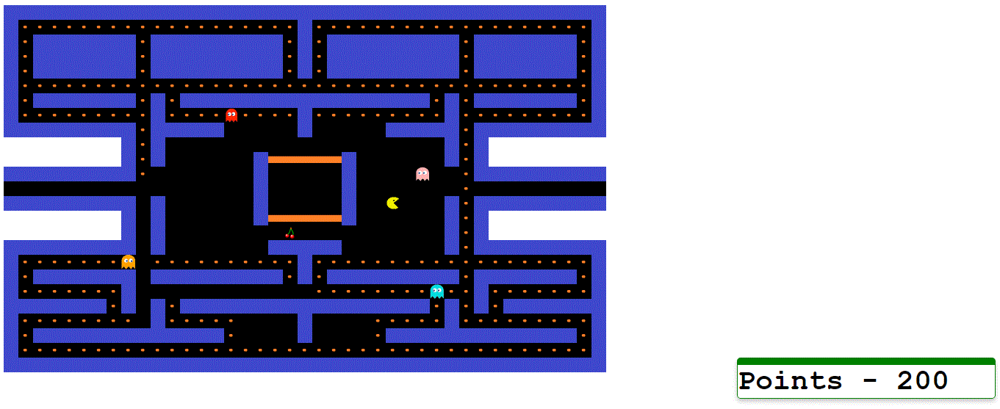

# Pacman
The [classical arcade game](https://en.wikipedia.org/wiki/Pac-Man) with some interesting tweaks and secret cheat codes!

## How to play the game 

Download the repository - [Pacman](https://github.com/gbelwariar/Pacman) and execute the HTML file - **pacman.html** (*TypeRacer/public_html/pacman.html*) through the local host using any browser, preferably Google Chrome.

## Spoiler Alert! - Cheat Code

When an enemy is approaching towards you, then move as fast as you can towards it. You **may** be able to bypass it!

## Screenshots (when played in Chrome Browser)

 

## Languages/Frameworks Used - 

1) JavaScript  
2) AngularJS (1.x)
3) HTML
4) CSS

## Phases of the Projects

**1. Requirements** - Prefer to use Google Chrome as the game appears to be laggy in Mozilla Firefox (See [this](https://github.com/gbelwariar/Pacman/issues/1) issue). An internet connection is not required. 
**2. Design** - The gameboard is divided into small blocks, which in totality gives the view of a full-fledged board. The images of the building blocks of the game can be found [here](https://github.com/gbelwariar/Pacman/tree/master/public_html/images). A listener is installed in the application to listen to the keyboard activities of the player. The enemies movements are asynchronous whereas the movement of the user, aka the pac-man, is synchronous. For even a singe movement of an enemy/user, the whole template is re-computed multiple times, thus incurring a substantial overhead. 
**3. Implementation** - Refer to the "**Languages/Frameworks Used**" section above to know the technologies used in this project. 
**4. Testing** - To be added soon. 
**5. Maintenance** - Any suggestions to improve the projects are welcome on gbelwariar@gmail.com or can be directly sent as a PR. 

## Components of the Projects

Name of the Component                                                                                                    | Description
-------------------------------------------------------------------------------------------------------------------------| -------------
[**Pacman Game**](https://github.com/gbelwariar/Pacman/tree/master/public_html/pacman-game)                              | This  component/directive is responsible for the following tasks -  1) Computing the tempate of the game programmatically.  2) Listen to the user's keyboard events.  3) Providing movement to the enemies (Note that all the enemies use different algorithms to move).  4) Declare the result of the game.  5) Defining the count of cherries, the positions of cherries and the score after which they get activated.
[**Scoreboard**](https://github.com/gbelwariar/Pacman/tree/master/public_html/scoreboard)                                | Responsible for displaying the score to the user.                                                                                        
[**Enemy Service**](https://github.com/gbelwariar/Pacman/blob/master/public_html/services/enemy-service.js)              | Responsible for the following tasks -  1) Defining the different algorithms used by the enemies to move.  2) Defining the positions around which the enemies revolve, when in SCATTER mode. 
[**Scoreboard Service**](https://github.com/gbelwariar/Pacman/blob/master/public_html/services/scoreboard-service.js)    | Responsible for incrementing the score of the user when pac-man consumes a pac-dot or a cherry and sharing it with other compoonents.
[**Value Service**](https://github.com/gbelwariar/Pacman/blob/master/public_html/services/value-service.js)              | Responsible for defining the blueprint of the game board.
[**Constant Service**](https://github.com/gbelwariar/Pacman/blob/master/public_html/services/constant-service.js)        | Responsible for defining the three modes of an enemy's movement - SCATTER, FRIGHTENED, CHASE.

## Scope of improvements

1) Make the game faster. See [this](https://github.com/gbelwariar/Pacman/issues/1) issue for more details.
2) Make the eyes of the enemies in sync with the direction in which they are moving.
3) Introduce more levels of increasing difficulty if the player wins the game.
